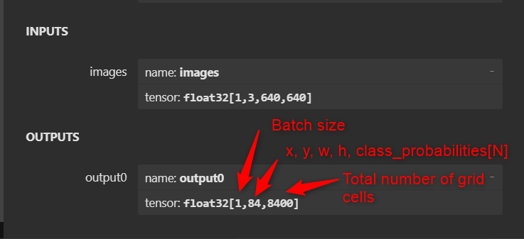
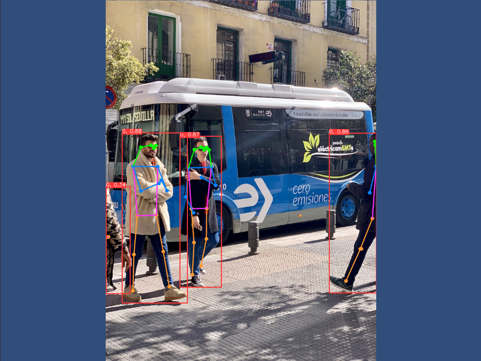

# YOLOv8 With OpenCVForUnity Example
- An example of using OpenCV dnn module with YOLOv8. [https://docs.ultralytics.com/models/yolov8/](https://docs.ultralytics.com/models/yolov8/)
- This example can also work for [YOLOv5u](https://docs.ultralytics.com/models/yolov5/), [YOLOv9](https://docs.ultralytics.com/models/yolov9/), ~~[YOLOv10](https://docs.ultralytics.com/models/yolov10/)~~, [YOLOv11](https://docs.ultralytics.com/models/yolov11/), [YOLOv12](https://docs.ultralytics.com/models/yolov12/) models, which has the same input/output shapes as the YOLOv8 model.

 

## Environment
- Windows / Mac / Linux / WebGL / Android / iOS
- Unity >= 2021.3.35f1+
- Scripting backend MONO / IL2CPP
- [OpenCV for Unity](https://assetstore.unity.com/packages/tools/integration/opencv-for-unity-21088?aid=1011l4ehR) 2.6.5+

## Setup
1. Download the latest release unitypackage. [YOLOv8WithOpenCVForUnityExample.unitypackage](https://github.com/EnoxSoftware/YOLOv8WithOpenCVForUnityExample/releases)
1. Create a new project. (YOLOv8WithOpenCVForUnityExample)
1. Import OpenCVForUnity.
1. Import the YOLOv8WithOpenCVForUnityExample.unitypackage.
1. Add the "Assets/YOLOv8WithOpenCVForUnityExample/*.unity" files to the "Scenes In Build" list in the "Build Settings" window.
1. Build and Deploy.

## Training from custom data and export to ONNX
1. [YOLOv8_export_to_OpenCVDNN_ONNX](https://github.com/EnoxSoftware/YOLOv8WithOpenCVForUnityExample/tree/master/models/YOLOv8/)
1. [YOLOv5u_export_to_OpenCVDNN_ONNX](https://github.com/EnoxSoftware/YOLOv8WithOpenCVForUnityExample/tree/master/models/YOLOv5u/)
1. [YOLOv9_export_to_OpenCVDNN_ONNX](https://github.com/EnoxSoftware/YOLOv8WithOpenCVForUnityExample/tree/master/models/YOLOv9/)
1. [YOLOv10_export_to_OpenCVDNN_ONNX](https://github.com/EnoxSoftware/YOLOv8WithOpenCVForUnityExample/tree/master/models/YOLOv10/)
1. [YOLOv11_export_to_OpenCVDNN_ONNX](https://github.com/EnoxSoftware/YOLOv8WithOpenCVForUnityExample/tree/master/models/YOLOv11/)
1. [YOLOv12_export_to_OpenCVDNN_ONNX](https://github.com/EnoxSoftware/YOLOv8WithOpenCVForUnityExample/tree/master/models/YOLOv12/)

## Tutorials
1. [How to Train Ultralytics YOLOv8 models on Your Custom Dataset in Google Colab](https://www.youtube.com/watch?v=LNwODJXcvt4)

## Works with Multi-Object Tracking (MOT)
1. [MultiObjectTrackingExample](https://github.com/EnoxSoftware/OpenCVForUnity/tree/master/Assets/OpenCVForUnity/Examples/Advanced/MultiObjectTrackingExample)

## ScreenShot

