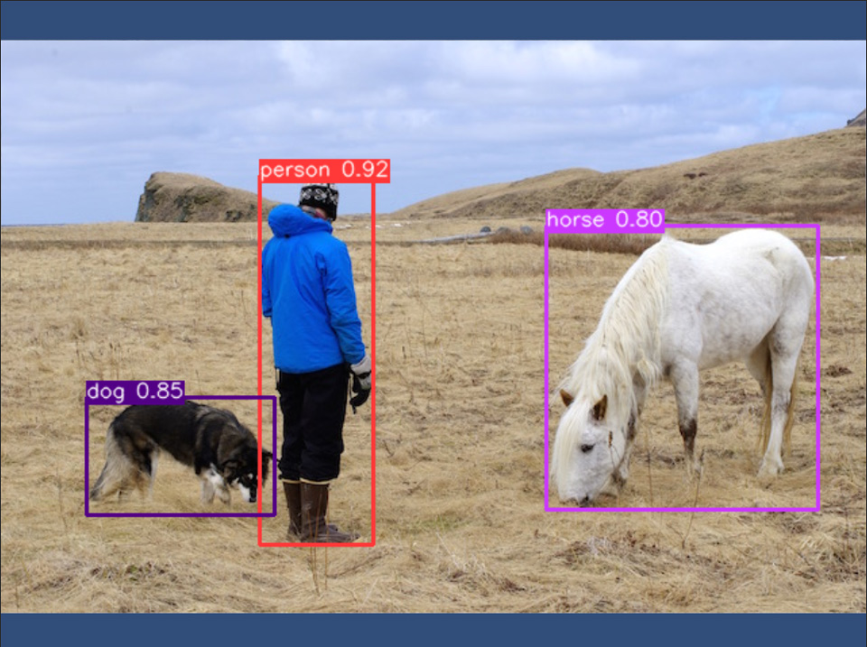
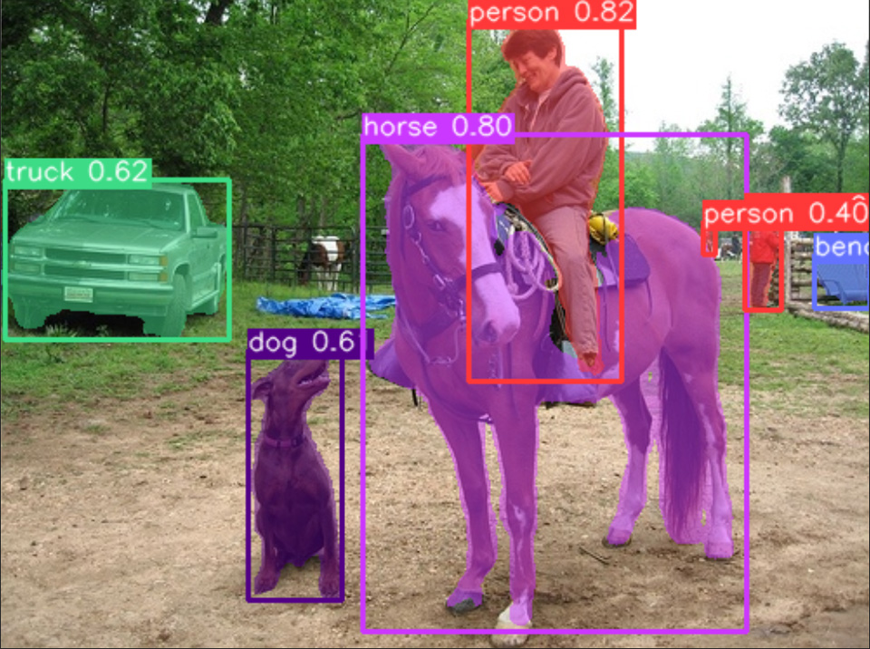
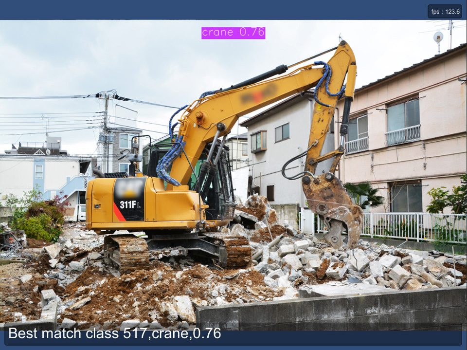

# YOLOv8 With OpenCVForUnity Example
- An example of using OpenCV dnn module with YOLOv8. [https://github.com/ultralytics/ultralytics](https://github.com/ultralytics/ultralytics)

## Environment
- Windows / Mac / Linux / WebGL / Android / iOS
- Unity >= 2019.4.31f1+
- Scripting backend MONO / IL2CPP
- [OpenCV for Unity](https://assetstore.unity.com/packages/tools/integration/opencv-for-unity-21088?aid=1011l4ehR) 2.5.7+

## Setup
1. Download the latest release unitypackage. [YOLOv8WithOpenCVForUnityExample.unitypackage](https://github.com/EnoxSoftware/YOLOv8WithOpenCVForUnityExample/releases)
1. Create a new project. (YOLOv8WithOpenCVForUnityExample)
1. Import OpenCVForUnity.
1. Import the YOLOv8WithOpenCVForUnityExample.unitypackage.
1. Add the "Assets/YOLOv8WithOpenCVForUnityExample/*.unity" files to the "Scenes In Build" list in the "Build Settings" window.
1. Build and Deploy.

## Export YOLOv8 model to ONNX
1. [YOLOv8_export_to_OpenCVDNN_ONNX.ipynb](https://github.com/EnoxSoftware/YOLOv8WithOpenCVForUnityExample/tree/master/models/YOLOv8-OpenCV/YOLOv8_export_to_OpenCVDNN_ONNX.ipynb)

## ScreenShot
 
 
 

## Tutorials
1. [How to Train Ultralytics YOLOv8 models on Your Custom Dataset in Google Colab](https://www.youtube.com/watch?v=LNwODJXcvt4)

